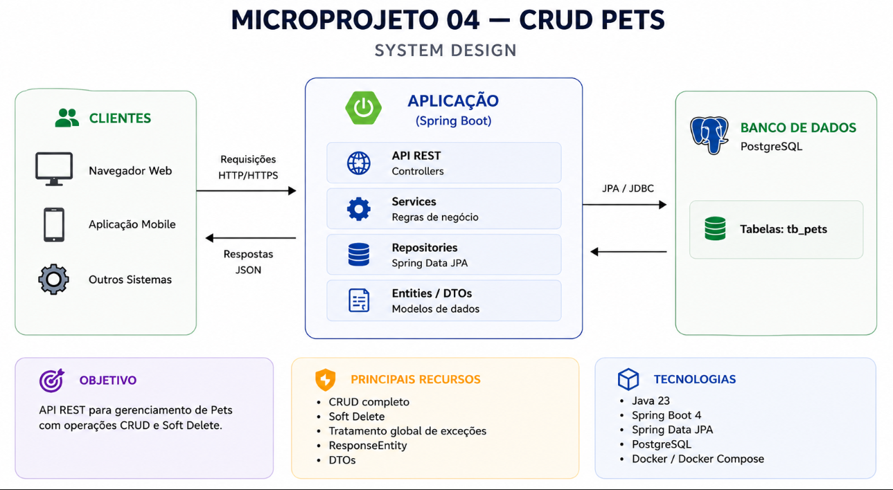

<p align="center">
  <h1>
    Microprojeto: CRUD Pets
  </h1>
</p>

<div style="display: flex; align-items: center; padding: 10px;">
  <span>
    <a href="https://github.com/rafael-o-cunha/">
        
    </a>
  </span>
</div>

---

<div style="display: flex; align-items: center; padding: 10px;">
  <span>
    <a href="https://github.com/rafael-o-cunha/microprojeto_04_crud/blob/springboot_jpa/README.md">
      
    </a>
  </span>
<span>
    <a href="https://github.com/rafael-o-cunha/microprojeto_04_crud/blob/springboot_jpa/README_EN.md">
      
    </a>
  </span>
  <span>
    <a href="https://github.com/rafael-o-cunha/microprojeto_04_crud/blob/springboot_jpa/README_ES.md">
      
    </a>
  </span>
</div>

---

# 📋 Resumo

CRUD Pets é um microprojeto backend desenvolvido com **Java 23** e **Spring Boot**, criado com o objetivo de praticar a implementação completa de uma API REST utilizando arquitetura em camadas.

A aplicação implementa um CRUD completo para gerenciamento de Pets, contemplando operações de criação, consulta, atualização e remoção lógica (**Soft Delete**), utilizando persistência com Spring Data JPA e PostgreSQL.

Mais do que implementar um CRUD, este projeto foi concebido como um laboratório prático para consolidar conceitos fundamentais do ecossistema Spring Boot utilizados em aplicações corporativas.





---

> **⚠️ Nota sobre este microprojeto**
>
> Este projeto foi desenvolvido com um objetivo educacional muito específico: praticar a implementação de um CRUD utilizando Java e Spring Boot.
>
> O foco está em compreender os principais recursos do framework e exercitar o fluxo completo de desenvolvimento de uma API REST, explorando gradualmente seus componentes e funcionalidades.
>
> Por esse motivo, algumas decisões de arquitetura, validações, padrões de projeto e boas práticas mais avançadas foram propositalmente deixadas para os próximos microprojetos da série, onde cada tema será abordado de forma isolada e com maior profundidade.
>
> Se você possui experiência com Spring Boot, provavelmente encontrará pontos que poderiam ser implementados de outra maneira. Isso faz parte da proposta: cada microprojeto tem um escopo reduzido para manter o foco no conceito estudado naquele momento, evitando introduzir muitas abstrações simultaneamente.
>
> Em outras palavras: **o objetivo aqui não é construir a API perfeita, mas compreender profundamente os fundamentos do Spring Boot antes de evoluir para arquiteturas e recursos mais avançados.**

---

# 🎯 Objetivo Educacional

Este projeto foi desenvolvido como um laboratório prático para consolidar os principais conceitos envolvidos na construção de APIs REST utilizando Java e Spring Boot e pertence a um conjunto de microprojetos que abordam tema específicos de desenvolvimento.

Durante o desenvolvimento foram praticados:

## ✅ Construção de APIs RESTful

- Implementação completa das operações CRUD
- Uso adequado dos métodos HTTP (GET, POST, PUT e DELETE)
- Padronização de rotas REST
- Utilização de códigos HTTP apropriados

---

## ✅ Arquitetura em Camadas

Separação das responsabilidades utilizando o padrão:

- Controller
- Service
- Repository
- Entity
- DTO

---

## ✅ Persistência com Spring Data JPA

- Mapeamento de entidades
- Utilização de JpaRepository
- Query Methods
- Persistência utilizando PostgreSQL

---

## ✅ DTO (Data Transfer Object)

Separação entre os objetos da API e as entidades de persistência através de:

- Request DTO
- Response DTO
- Error Response DTO

---

## ✅ ResponseEntity

Construção de respostas HTTP padronizadas utilizando:

- 200 OK
- 201 Created
- 204 No Content
- 404 Not Found
- 409 Conflict

---

## ✅ Tratamento Global de Exceções

Centralização do tratamento de erros através de:

- @RestControllerAdvice
- Exceptions customizadas
- Padronização das respostas de erro

---

## ✅ Soft Delete

Implementação de exclusão lógica utilizando o atributo:

```text
deleted (boolean)
```

Ao invés de remover fisicamente o registro do banco de dados, a aplicação altera seu estado para inativo, preservando o histórico das informações.

---

## ✅ Modelagem de Regras de Negócio

Implementação de regras de domínio através de:

- BusinessException
- PetNotFoundException
- PetAlreadyDeletedException

Além disso, a própria entidade é responsável por proteger seu estado através do método:

```java
markAsDeleted()
```

impedindo exclusões repetidas.

---

## ✅ Ambiente Containerizado

Padronização do ambiente utilizando:

- Docker
- Docker Compose
- Makefile

---

# 🚀 Tecnologias

- Java 23
- Spring Boot 4
- Spring Web MVC
- Spring Data JPA
- PostgreSQL
- Lombok
- Maven
- Docker
- Docker Compose
- Makefile

---

# 📘 Endpoints

| Método | Endpoint       | Descrição   |
| ------- | -------------- | ------------- |
| POST    | `/pets`      | Criar Pet     |
| GET     | `/pets`      | Listar Pets   |
| GET     | `/pets/{id}` | Buscar Pet    |
| PUT     | `/pets/{id}` | Atualizar Pet |
| DELETE  | `/pets/{id}` | Soft Delete   |

---

# 🗑️ Soft Delete

A remoção de registros foi implementada utilizando o padrão **Soft Delete**.

Ao invés de remover fisicamente um Pet do banco de dados, o atributo:

```text
deleted = true
```

é atualizado.

Dessa forma:

- registros ativos continuam disponíveis normalmente;
- registros removidos deixam de aparecer nas consultas;
- o histórico dos dados permanece preservado;
- exclusões repetidas são tratadas como conflito de negócio.

---

# ⚠️ Tratamento de Exceções

A API possui tratamento global de exceções através do `@RestControllerAdvice`.

Atualmente são tratados:

| Status HTTP   | Situação          |
| ------------- | ------------------- |
| 404 Not Found | Pet não encontrado |
| 409 Conflict  | Pet já removido    |

Todas as respostas seguem um padrão JSON:

```json
{
    "timestamp": "...",
    "status": 404,
    "error": "Not Found",
    "message": "Pet com id 10 não foi encontrado.",
    "path": "/pets/10"
}
```

---

# ▶️ Executar (Docker + Makefile)

```bash
make build        # Build das imagens Docker
make up           # Inicializa os containers
make spring-run   # Executa a aplicação Spring Boot
```

---

## Comandos úteis

```bash
make ps           # Lista os containers
make logs         # Exibe logs da aplicação
make exec         # Acessa o container da aplicação
make exec-db      # Acessa o container PostgreSQL
make psql         # Abre o terminal do PostgreSQL
make mvn-test     # Executa os testes
make mvn-package  # Gera o pacote da aplicação
make spring-debug # Executa a aplicação em modo debug (porta 5005)
make down         # Encerra os containers
make clean        # Remove containers, volumes e dados do banco
```

---

# 📂 Estrutura

```text
src/main/java/praticas/microprojeto_04
│
├── controller
├── dto
├── entity
├── exception
├── repository
├── service
└── Microprojeto04Application
```

---

# 🎓 Conceitos Praticados

Durante o desenvolvimento deste microprojeto foram praticados os seguintes conceitos do ecossistema Spring Boot:

- Spring MVC
- REST APIs
- Controllers
- Services
- Repository Pattern
- Spring Data JPA
- DTO Pattern
- ResponseEntity
- Exception Handler
- Business Exceptions
- Optional
- Soft Delete
- Builder Pattern
- Lombok
- PostgreSQL

---

# 🔧 Próximos Passos / Melhorias

O próximo microprojeto possivelmente abordará os temas abaixo:

→ Bean Validation

→ MapStruct

→ PATCH (Atualização Parcial)

→ Paginação

→ Ordenação

→ Filtros

→ Specifications

---

# 📂 Descrição completa do Projeto

```text
https://rafael-o-cunha.dev/projects/api-pratica-springboot-crud
```
