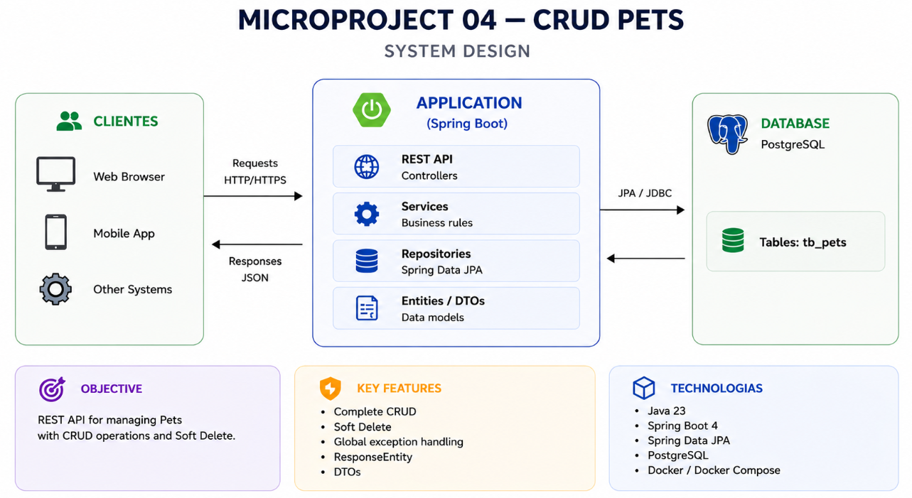

<p align="center">
  <h1>
    Microproject: CRUD Pets
  </h1>
</p>

<div style="display: flex; align-items: center; padding: 10px;">
  <span>
    <a href="https://github.com/rafael-o-cunha/">
        
    </a>
  </span>
</div>

---

<div style="display: flex; align-items: center; padding: 10px;">
  <span>
    <a href="https://github.com/rafael-o-cunha/microprojeto_04_crud/blob/springboot_jpa/README.md">
      
    </a>
  </span>

  <span>
    <a href="https://github.com/rafael-o-cunha/microprojeto_04_crud/blob/springboot_jpa/README_EN.md">
      
    </a>
  </span>

  <span>
    <a href="https://github.com/rafael-o-cunha/microprojeto_04_crud/blob/springboot_jpa/README_ES.md">
      
    </a>
  </span>
</div>

---

# 📋 Overview

CRUD Pets is a backend microproject developed with **Java 23** and **Spring Boot**, created to practice the complete implementation of a REST API using a layered architecture.

The application implements a complete CRUD for Pet management, including create, read, update and logical deletion (**Soft Delete**) operations, using Spring Data JPA and PostgreSQL for data persistence.

More than simply implementing a CRUD application, this project was designed as a practical laboratory to consolidate the fundamental concepts of the Spring Boot ecosystem commonly used in enterprise applications.





---

> **⚠️ About this microproject**
>
> This project was developed with a very specific educational purpose: to practice implementing a CRUD application using Java and Spring Boot.
>
> The main goal is to understand the framework's core features and exercise the complete REST API development workflow while gradually exploring its components and capabilities.
>
> For this reason, some architectural decisions, validations, design patterns, and more advanced best practices were intentionally left for the next microprojects in this series, where each topic will be explored individually and in greater depth.
>
> If you already have experience with Spring Boot, you will probably notice areas that could be implemented differently. This is intentional: each microproject has a limited scope in order to keep the focus on the concept being studied at that moment, avoiding the introduction of too many abstractions at once.
>
> In other words: **the goal is not to build the perfect API, but to deeply understand the fundamentals of Spring Boot before moving on to more advanced architectures and features.**

---

# 🎯 Educational Purpose

This project was developed as a practical laboratory to consolidate the core concepts involved in building REST APIs with Java and Spring Boot. It is part of a series of microprojects, each one focused on a specific software development topic.

During the development, the following concepts were practiced:

## ✅ RESTful API Development

- Complete CRUD implementation
- Proper use of HTTP methods (GET, POST, PUT and DELETE)
- REST endpoint standardization
- Proper use of HTTP status codes

---

## ✅ Layered Architecture

Separation of responsibilities using the following layers:

- Controller
- Service
- Repository
- Entity
- DTO

---

## ✅ Persistence with Spring Data JPA

- Entity mapping
- JpaRepository usage
- Query Methods
- PostgreSQL persistence

---

## ✅ DTO (Data Transfer Object)

Separation between API objects and persistence entities through:

- Request DTO
- Response DTO
- Error Response DTO

---

## ✅ ResponseEntity

Standardized HTTP responses using:

- 200 OK
- 201 Created
- 204 No Content
- 404 Not Found
- 409 Conflict

---

## ✅ Global Exception Handling

Centralized error handling through:

- @RestControllerAdvice
- Custom Exceptions
- Standardized error responses

---

## ✅ Soft Delete

Logical deletion implemented using the following attribute:

```text
deleted (boolean)
```

Instead of physically removing records from the database, the application changes their state to inactive while preserving historical information.

---

## ✅ Business Rule Modeling

Business rules were implemented through:

- BusinessException
- PetNotFoundException
- PetAlreadyDeletedException

Additionally, the entity itself is responsible for protecting its own state through the following method:

```java
markAsDeleted()
```

preventing repeated deletion attempts.

---

## ✅ Containerized Development Environment

Standardized development environment using:

- Docker
- Docker Compose
- Makefile

---

# 🚀 Technologies

- Java 23
- Spring Boot 4
- Spring Web MVC
- Spring Data JPA
- PostgreSQL
- Lombok
- Maven
- Docker
- Docker Compose
- Makefile

---

# 📘 Endpoints

| Method | Endpoint | Description |
| ------- | -------- | ----------- |
| POST | `/pets` | Create Pet |
| GET | `/pets` | List Pets |
| GET | `/pets/{id}` | Find Pet by ID |
| PUT | `/pets/{id}` | Update Pet |
| DELETE | `/pets/{id}` | Soft Delete |

---

# 🗑️ Soft Delete

Record deletion was implemented using the **Soft Delete** pattern.

Instead of physically removing a Pet from the database, the following attribute:

```text
deleted = true
```

is updated.

This approach ensures that:

- active records remain available through normal queries;
- deleted records are no longer returned by the API;
- historical data is preserved;
- repeated deletion attempts are handled as a business conflict.

---

# ⚠️ Exception Handling

The API provides global exception handling through `@RestControllerAdvice`.

Currently, the following scenarios are handled:

| HTTP Status | Scenario |
|-------------|----------|
| 404 Not Found | Pet not found |
| 409 Conflict | Pet has already been deleted |

All error responses follow the same JSON structure:

```json
{
    "timestamp": "...",
    "status": 404,
    "error": "Not Found",
    "message": "Pet with id 10 was not found.",
    "path": "/pets/10"
}
```

---

# ▶️ Running (Docker + Makefile)

```bash
make build        # Build Docker images
make up           # Start the containers
make spring-run   # Run the Spring Boot application
```

---

## Useful Commands

```bash
make ps           # List running containers
make logs         # Display application logs
make exec         # Access the application container
make exec-db      # Access the PostgreSQL container
make psql         # Open the PostgreSQL terminal
make mvn-test     # Run the test suite
make mvn-package  # Build the application package
make spring-debug # Run the application in debug mode (port 5005)
make down         # Stop the containers
make clean        # Remove containers, volumes and database data
```

---

# 📂 Project Structure

```text
src/main/java/praticas/microprojeto_04
│
├── controller
├── dto
├── entity
├── exception
├── repository
├── service
└── Microprojeto04Application
```

---

# 🎓 Concepts Covered

During the development of this microproject, the following Spring Boot concepts were practiced:

- Spring MVC
- REST APIs
- Controllers
- Services
- Repository Pattern
- Spring Data JPA
- DTO Pattern
- ResponseEntity
- Exception Handler
- Business Exceptions
- Optional
- Soft Delete
- Builder Pattern
- Lombok
- PostgreSQL

---

# 🔧 Next Steps / Improvements

The next microproject will likely cover the following topics:

→ Bean Validation

→ MapStruct

→ PATCH (Partial Update)

→ Pagination

→ Sorting

→ Filtering

→ Specifications

---

# 📂 Complete Project Description

```text
https://rafael-o-cunha.dev/projects/api-pratica-springboot-crud
```