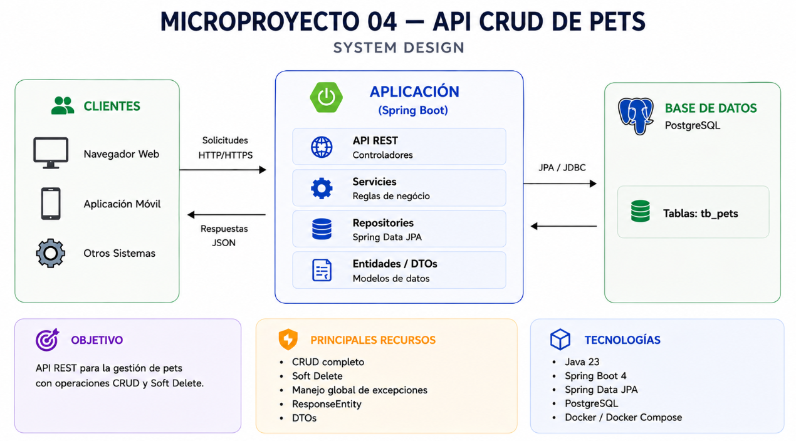

<p align="center">
  <h1>
    Microproyecto: CRUD de Pets
  </h1>
</p>

<div style="display: flex; align-items: center; padding: 10px;">
  <span>
    <a href="https://github.com/rafael-o-cunha/">
        
    </a>
  </span>
</div>

---

<div style="display: flex; align-items: center; padding: 10px;">
  <span>
    <a href="https://github.com/rafael-o-cunha/microprojeto_04_crud/blob/springboot_jpa/README.md">
      
    </a>
  </span>

  <span>
    <a href="https://github.com/rafael-o-cunha/microprojeto_04_crud/blob/springboot_jpa/README_EN.md">
      
    </a>
  </span>

  <span>
    <a href="https://github.com/rafael-o-cunha/microprojeto_04_crud/blob/springboot_jpa/README_ES.md">
      
    </a>
  </span>
</div>

---

# 📋 Resumen

CRUD de Pets es un microproyecto backend desarrollado con **Java 23** y **Spring Boot**, creado con el objetivo de practicar la implementación completa de una API REST utilizando una arquitectura por capas.

La aplicación implementa un CRUD completo para la gestión de Pets, incluyendo operaciones de creación, consulta, actualización y eliminación lógica (**Soft Delete**), utilizando Spring Data JPA y PostgreSQL como mecanismo de persistencia.

Más que implementar simplemente un CRUD, este proyecto fue concebido como un laboratorio práctico para consolidar los conceptos fundamentales del ecosistema Spring Boot utilizados en aplicaciones empresariales.





---

> **⚠️ Nota sobre este microproyecto**
>
> Este proyecto fue desarrollado con un objetivo educativo muy específico: practicar la implementación de un CRUD utilizando Java y Spring Boot.
>
> El enfoque principal es comprender las características fundamentales del framework y recorrer todo el flujo de desarrollo de una API REST, explorando gradualmente sus componentes y funcionalidades.
>
> Por esta razón, algunas decisiones de arquitectura, validaciones, patrones de diseño y buenas prácticas más avanzadas fueron intencionalmente reservadas para los próximos microproyectos de esta serie, donde cada tema será abordado de forma individual y con mayor profundidad.
>
> Si ya tienes experiencia con Spring Boot, probablemente encontrarás aspectos que podrían implementarse de otra manera. Esto forma parte de la propuesta: cada microproyecto tiene un alcance reducido para mantener el enfoque en el concepto que se está estudiando en ese momento, evitando introducir demasiadas abstracciones simultáneamente.
>
> En otras palabras: **el objetivo aquí no es construir la API perfecta, sino comprender en profundidad los fundamentos de Spring Boot antes de avanzar hacia arquitecturas y funcionalidades más avanzadas.**

---

# 🎯 Objetivo Educativo

Este proyecto fue desarrollado como un laboratorio práctico para consolidar los principales conceptos relacionados con la construcción de APIs REST utilizando Java y Spring Boot. Forma parte de una serie de microproyectos, cada uno enfocado en un tema específico del desarrollo de software.

Durante el desarrollo se practicaron los siguientes conceptos:

## ✅ Desarrollo de APIs RESTful

- Implementación completa de las operaciones CRUD
- Uso adecuado de los métodos HTTP (GET, POST, PUT y DELETE)
- Estandarización de rutas REST
- Uso correcto de los códigos de estado HTTP

---

## ✅ Arquitectura por Capas

Separación de responsabilidades utilizando las siguientes capas:

- Controller
- Service
- Repository
- Entity
- DTO

---

## ✅ Persistencia con Spring Data JPA

- Mapeo de entidades
- Uso de JpaRepository
- Query Methods
- Persistencia con PostgreSQL

---

## ✅ DTO (Data Transfer Object)

Separación entre los objetos de la API y las entidades de persistencia mediante:

- Request DTO
- Response DTO
- Error Response DTO

---

## ✅ ResponseEntity

Construcción de respuestas HTTP estandarizadas utilizando:

- 200 OK
- 201 Created
- 204 No Content
- 404 Not Found
- 409 Conflict

---

## ✅ Manejo Global de Excepciones

Centralización del tratamiento de errores mediante:

- @RestControllerAdvice
- Excepciones personalizadas
- Estandarización de las respuestas de error

---

## ✅ Soft Delete

Implementación de la eliminación lógica utilizando el atributo:

```text
deleted (boolean)
```

En lugar de eliminar físicamente el registro de la base de datos, la aplicación cambia su estado a inactivo, preservando el historial de la información.

---

## ✅ Modelado de Reglas de Negocio

Las reglas de negocio fueron implementadas mediante:

- BusinessException
- PetNotFoundException
- PetAlreadyDeletedException

Además, la propia entidad es responsable de proteger su estado mediante el método:

```java
markAsDeleted()
```

evitando intentos de eliminación repetidos.

---

## ✅ Entorno de Desarrollo Contenerizado

Estandarización del entorno de desarrollo utilizando:

- Docker
- Docker Compose
- Makefile

---

# 🚀 Tecnologías

- Java 23
- Spring Boot 4
- Spring Web MVC
- Spring Data JPA
- PostgreSQL
- Lombok
- Maven
- Docker
- Docker Compose
- Makefile

---

# 📘 Endpoints

| Método | Endpoint | Descripción |
| ------- | -------- | ----------- |
| POST | `/pets` | Crear Mascota |
| GET | `/pets` | Listar Pets |
| GET | `/pets/{id}` | Buscar Mascota por ID |
| PUT | `/pets/{id}` | Actualizar Mascota |
| DELETE | `/pets/{id}` | Soft Delete |

---

# 🗑️ Soft Delete

La eliminación de registros fue implementada utilizando el patrón **Soft Delete**.

En lugar de eliminar físicamente una mascota de la base de datos, se actualiza el siguiente atributo:

```text
deleted = true
```

De esta manera:

- los registros activos continúan disponibles mediante las consultas normales;
- los registros eliminados dejan de ser devueltos por la API;
- se preserva el historial de los datos;
- los intentos de eliminación repetidos son tratados como un conflicto de negocio.

---

# ⚠️ Manejo de Excepciones

La API proporciona un manejo global de excepciones mediante `@RestControllerAdvice`.

Actualmente se manejan los siguientes escenarios:

| Estado HTTP | Situación |
|-------------|-----------|
| 404 Not Found | Mascota no encontrada |
| 409 Conflict | La mascota ya fue eliminada |

Todas las respuestas de error siguen una estructura JSON estandarizada:

```json
{
    "timestamp": "...",
    "status": 404,
    "error": "Not Found",
    "message": "La mascota con id 10 no fue encontrada.",
    "path": "/pets/10"
}
```

---

# ▶️ Ejecución (Docker + Makefile)

```bash
make build        # Construye las imágenes Docker
make up           # Inicia los contenedores
make spring-run   # Ejecuta la aplicación Spring Boot
```

---

## Comandos útiles

```bash
make ps           # Lista los contenedores en ejecución
make logs         # Muestra los logs de la aplicación
make exec         # Accede al contenedor de la aplicación
make exec-db      # Accede al contenedor de PostgreSQL
make psql         # Abre la terminal de PostgreSQL
make mvn-test     # Ejecuta las pruebas
make mvn-package  # Genera el paquete de la aplicación
make spring-debug # Ejecuta la aplicación en modo depuración (puerto 5005)
make down         # Detiene los contenedores
make clean        # Elimina contenedores, volúmenes y los datos de la base de datos
```

---

# 📂 Estructura del Proyecto

```text
src/main/java/praticas/microprojeto_04
│
├── controller
├── dto
├── entity
├── exception
├── repository
├── service
└── Microprojeto04Application
```

---

# 🎓 Conceptos Practicados

Durante el desarrollo de este microproyecto se practicaron los siguientes conceptos del ecosistema Spring Boot:

- Spring MVC
- REST APIs
- Controllers
- Services
- Repository Pattern
- Spring Data JPA
- DTO Pattern
- ResponseEntity
- Exception Handler
- Business Exceptions
- Optional
- Soft Delete
- Builder Pattern
- Lombok
- PostgreSQL

---

# 🔧 Próximos Pasos / Mejoras

El próximo microproyecto probablemente abordará los siguientes temas:

→ Bean Validation

→ MapStruct

→ PATCH (Actualización Parcial)

→ Paginación

→ Ordenación

→ Filtros

→ Specifications

---

# 📂 Descripción completa del Proyecto

```text
https://rafael-o-cunha.dev/projects/api-pratica-springboot-crud
```